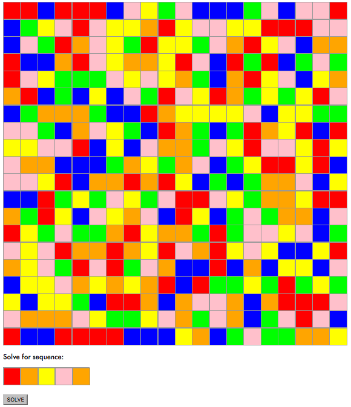
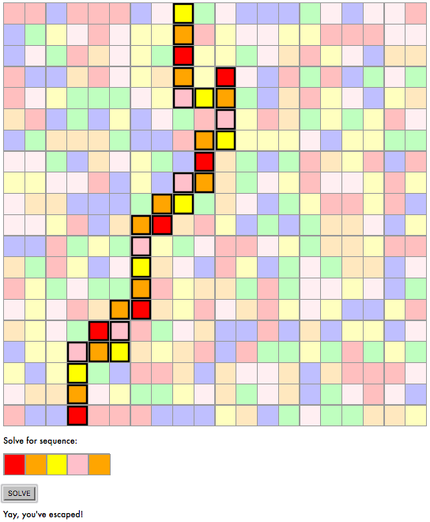
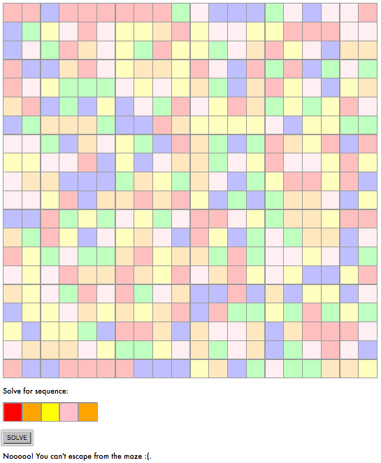

# color-maze
Escape the maze based on the provided color sequence.
Here I use React to create a basic interactive solution and a Breadth First Search that takes into account the color sequence to identifiy the possible states reachable from a given state.

## Screenshots
Starting maze:
  

Solved maze:  
  

A maze that cannot be solved:

## Description  
Challenge #325 from [/r/dailyprogrammer](https://www.reddit.com/r/dailyprogrammer/comments/6qutez/20170801_challenge_325_easy_color_maze/?ref=share&ref_source=link):  

You traverse a color by following a sequence of colors.
For the mazes you always pick a spot on the bottom, in the starting color and try to get to the first row. Once you reach the first row, you are out of the maze. The sequence does not have to be complete.
You can move horizontally and vertically, but not diagonally. It is also allowed to move on the same node more then once.  

## Formal Inputs &amp; Outputs

### Input description

You will recieve a line with the sequence to follow and all the lines after that are the maze.

    O G
    B O R O Y
    O R B G R
    B O G O Y 
    Y G B Y G 
    R O R B R

### Output description

You can choose what you want to output: you could output the path, you could plot out the sequence, or you could create an image result or go even fancier if you want to.
